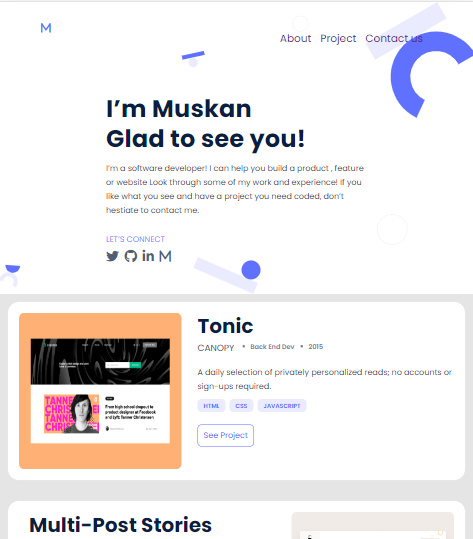

# PORTFOLIO
MAKING A PORTFOLIO

# User Interface
 

 ## Live Demo
 https://muskan2532150.github.io/PORTFOLIO/

## Built With

- HTML
- CSS

## Getting Started

To get a local copy up and running follow these simple example steps.

### Prerequisites
A BROWSER IS NEEDED (CHROME,MICROSOFT EDGE)

## Author

- GitHub: @muskan2532150
- Twitter: @muskan2532150

## 🤝 Contributing

Contributions, issues, and feature requests are welcome!

Feel free to check the [issues page](../../issues/).

## Show your support

Give a ⭐️ if you like this project!

## Acknowledgments

- Hat tip to anyone whose code was used
- Inspiration
- etc

## 📝 License

This project is [MIT](./MIT.md) licensed.
